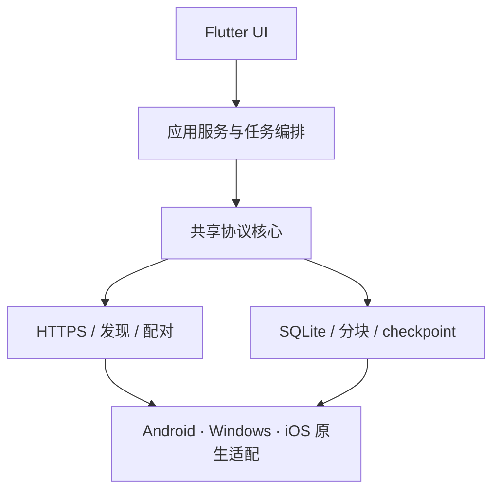

<div align="center">

# NearSend · 近传

### 无需互联网，让手机与电脑安全、可靠地互传大文件，断线后还能继续。

[](#项目状态)
[](https://flutter.dev/)
[](#平台路线图)
[](LICENSE)

**本地直连 · 大文件友好 · 严格校验 · 持久化断点续传**

</div>

---

## NearSend 是什么？

NearSend 是一款面向手机与电脑的跨平台离线文件互传工具。它不依赖互联网、云服务器或账号系统：设备通过现有局域网连接，或由 Android 创建本地热点，再使用经过身份验证的 HTTPS 通道直接传输文件。

NearSend 的目标不只是“传得快”，而是让几十 GiB 的大文件在网络中断、应用退出甚至设备重启之后，仍能从已经安全落盘并校验通过的位置继续传输。

> **离线**在本项目中表示“不需要互联网”，设备之间仍需建立本地 Wi-Fi 链路。

## 为什么是 NearSend？

| 能力 | NearSend 的设计 |
|---|---|
| 无互联网传输 | 同一局域网直接通信；无路由器时优先使用 Android LocalOnlyHotspot |
| 可靠断点续传 | 以接收方 SQLite 的已提交块为唯一权威，支持进程退出和设备重启后恢复 |
| 大文件支持 | 流式读写、有界缓冲与背压，目标支持至少 20 GiB 单文件，不把整文件载入内存 |
| 内容完整性 | 默认 4 MiB 分块；每块 SHA-256 校验，完成后执行整文件 SHA-256 校验 |
| 安全配对 | 二维码绑定 TLS 身份指纹，一次性配对令牌与任务级恢复授权分离 |
| 清晰用户反馈 | 明确区分准备、传输、恢复校验、保存等阶段，并在接收前计算完整空间需求 |
| 隐私优先 | 文件不经过第三方服务器；核心传输不需要账号、云日志或联网分析 |

## 核心用户旅程


1. 选择发送或接收；没有路由器时，由受支持的 Android 设备创建离线热点。
2. 一台设备展示二维码，另一台设备扫码并验证服务端身份。
3. 发送方选择文件，NearSend 显示扫描与哈希准备进度。
4. 接收方确认文件清单、保存位置和峰值空间需求后开始传输。
5. 中断时保留已验证内容；重连后先检查本地数据，只补传缺失块，最后校验并保存。

## 架构概览



核心设计原则：

- **一个协议核心**：协议字段、状态机、错误码和摘要规则不能由各平台各自解释。
- **接收方是断点权威**：只有完成校验、数据同步及 SQLite 事务提交的块才算可恢复进度。
- **身份与地址分离**：IP、端口和 SSID 可以变化，已验证的设备身份与任务授权不能随重连丢失。
- **安全不降级**：TLS 不可用或身份不匹配时明确失败，不回退到明文传输或全局忽略证书错误。
- **平台能力如实表达**：Android URI、iOS 文件授权和 Windows 网络能力均通过适配层处理，不假设所有设备行为一致。

## MVP 范围

| 已纳入首版 | 暂不承诺 |
|---|---|
| Android ↔ Windows 双向传输 | 跨互联网远程传输 |
| iOS 关键能力验证与后续正式集成 | 所有 Windows 网卡均能自动创建热点 |
| 文件与多文件队列 | BLE 承载文件数据 |
| 至少 20 GiB 单文件 | 目录实时同步 |
| HTTPS、分块/整文件校验 | 移动端后台无限运行 |
| 暂停、失败恢复、重启后续传 | 无交互静默安装更新 |
| 空间预检、临时存储和最终导出 | 未下载云端占位文件的离线读取 |

## 平台路线图

| 阶段 | 目标 | 状态 |
|---|---|---|
| S0 | 验证 Flutter I/O、TLS、SQLite 耐久性、Android 热点/URI、Windows 组网及 iOS 文件/网络边界 | **当前阶段** |
| S1 | 冻结协议 v1、清单规范、状态机、错误码和固定测试向量 | 待开始 |
| S2 | 打通 Android + Windows 端到端小文件与大文件传输 | 待开始 |
| S3 | 完成暂停、故障恢复、重启续传、空间管理与安全验收 | 待开始 |
| S4 | 完成 iOS 正式集成、设备矩阵测试及发布准备 | 待开始 |

计划发布渠道：

- **Android**：内测签名 APK；正式版 Google Play，并保留可信直接下载渠道。
- **Windows**：优先 MSIX，同时提供签名的直接下载包。
- **iOS**：TestFlight 内测，App Store 正式发布。

## 项目状态

NearSend 目前处于 **S0 技术验证与协议细化阶段**。仓库中的设计描述是目标和验收标准，不代表相应功能已经实现或经过真机验证。性能数据、兼容设备和最低系统版本会在实验完成后基于证据冻结。

当前优先事项：

- 验证 20 GiB 级流式读写、哈希和内存上限。
- 验证 checkpoint 的落盘顺序与崩溃恢复语义。
- 验证 Android LocalOnlyHotspot、网络绑定和 SAF URI 重启恢复。
- 验证 Windows 离线组网路径、监听与防火墙行为。
- 冻结协议 v1 与跨平台固定测试向量。

## 文档

- [完整技术方案 V2.1](docs/跨平台离线文件互传系统技术方案_V2.1.md)
- [AI 与贡献者开发规则](AGENTS.md)

`AGENTS.md` 是本项目对 Cursor、Claude Code、Codex 等 AI 编码工具的最高优先级项目规则，包含架构边界、安全要求、目录规范、开发工作流与必做检查。

## 开发原则

所有任务遵循：

```text
探索 → 规划 → 实现 → 验证 → 提交
```

贡献代码前请先阅读 [AGENTS.md](AGENTS.md)。复杂改动需要说明计划、风险和验收方式；每次交付必须报告实际测试结果、未执行项与剩余风险。协议、安全、存储、迁移和删除路径需要重点人工复核。

## 参与项目

项目仍处于早期阶段，欢迎围绕以下方向提交 Issue 或 Pull Request：

- Flutter 跨平台大文件 I/O 与背压设计
- Android/Windows/iOS 本地网络及文件授权适配
- TLS 身份绑定与离线二维码配对
- SQLite checkpoint、崩溃一致性与故障注入测试
- 可访问、可理解的传输与恢复交互体验

提交前请确保改动聚焦、测试可复现，并且没有把密钥、用户数据、构建产物或大文件样本加入仓库。

## License

[MIT License](LICENSE) © 2026 Azir

---

<div align="center">

**NearSend — Your files. Your devices. No cloud required.**

</div>
