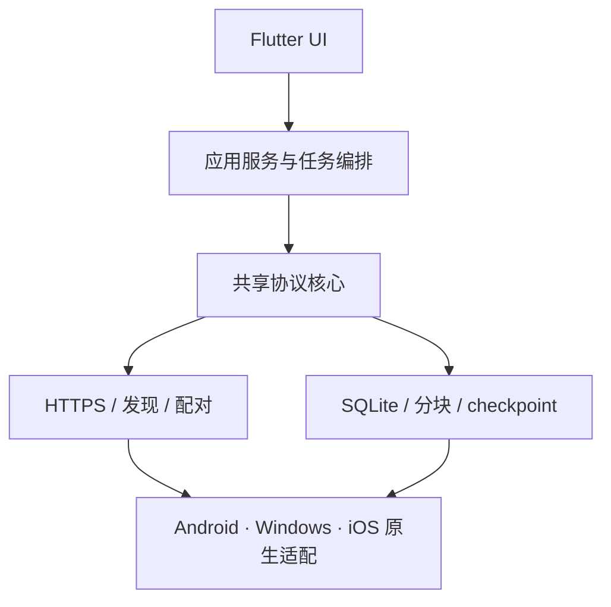

# NearSend · 近传

### 不经过互联网，让手机与电脑在本地 Wi-Fi 上安全传输大文件。

**本地直连 · 流式传输 · 严格校验 · 持久化断点续传设计**

---

## 现在就下载

截至 2026-09-29，最新 GitHub 预览版是 **[v0.1.14](https://github.com/yanzhao77/NearSend/releases/tag/v0.1.14)**，对应 `master` 提交 `dd90cb7d425a2d5af396d920a27b6ea60c1177d7`。这是预览构建，不是正式稳定版；自动发布只接受 `master` 成功 CI 的精确提交。

| 平台 | 安装包 | 说明 |
| --- | --- | --- |
| Android | [APK](https://github.com/yanzhao77/NearSend/releases/download/v0.1.14/NearSend-0.1.14-android.apk) | 当前使用 debug signing，仅供内部测试；不能作为正式升级链 |
| Windows x64 | [ZIP](https://github.com/yanzhao77/NearSend/releases/download/v0.1.14/NearSend-0.1.14-windows-x64.zip) | 解压后运行桌面程序 |
| macOS | [ZIP](https://github.com/yanzhao77/NearSend/releases/download/v0.1.14/NearSend-0.1.14-macos.zip) | 未签名、未 notarization |
| Linux amd64 | [DEB](https://github.com/yanzhao77/NearSend/releases/download/v0.1.14/NearSend-0.1.14-linux-amd64.deb) · [便携包](https://github.com/yanzhao77/NearSend/releases/download/v0.1.14/NearSend-0.1.14-linux-x64.tar.gz) | 当前只构建 amd64 |
| 校验 | [SHA256SUMS.txt](https://github.com/yanzhao77/NearSend/releases/download/v0.1.14/SHA256SUMS.txt) | 发布流水线自动生成 |

> **预览版本边界**：v0.1.14 的 CI、1418 项 Flutter 测试及 Android debug APK 构建通过，但没有该版本的目标设备验收。最新可引用的文件级真机证据仍是 v0.1.11：同一 5GHz Wi-Fi 下 Android→Windows 传输一个 6,683 字节文件并核对 SHA-256 成功。Windows→Android、热点、跨网络、断点恢复和大文件传输尚无通过证据。当前产物仅供预览测试，不是正式稳定发行包。

## NearSend 是什么？

NearSend 是一款面向手机与电脑的跨平台离线文件互传工具。它不依赖互联网、云服务器或账号系统：设备通过现有局域网连接，或由 Android 创建本地热点，再使用经过身份验证的 HTTPS 通道直接传输文件。

这里的“离线”是指**不需要互联网**，不是不需要网络。两台设备仍必须拥有可用的本地 Wi-Fi 链路。

NearSend 的重点是可靠性：文件通过流式读写和有界缓冲处理，按块校验并把接收方已提交的 checkpoint 作为恢复依据，让网络中断、进程退出和设备重启后的恢复行为可验证、可诊断。

## 当前能做什么

| 方向 | 当前状态 |
| --- | --- |
| 协议与数据模型 | `LFTM1` / `LFTC1` 清单编码、状态模型、错误模型和固定向量已有 Dart 独立实现；协议仍是草案，尚未冻结 |
| 安全控制面 | TLS 1.3 下限、证书指纹绑定、一次性配对令牌、会话授权和控制端点已有实现与测试 |
| 数据面 | SQLite manifest staging、授权、分块读写、终检与导出编排已有代码级测试；断点恢复的应用层编排仍在进行 |
| Flutter 应用 | Android、Windows、iOS 工程和 T12 共享 UI 基线已建立；PR #75–#78 已合并，包含发现/传输流程改进。v0.1.14 自动化测试和构建通过，但尚无该版本真机验证。当前有记录的文件级设备证据为 v0.1.11 同一 Wi-Fi 下 Android→Windows 小文件传输并通过 SHA-256 核对；反向传输、热点、跨网络、大文件恢复和断网续传仍未验证 |
| 自动化发布 | `master` 的 CI 成功后自动构建 Android、Windows、macOS、Linux 并创建 GitHub Release，附带 release notes 与 SHA-256 清单 |

**当前没有承诺的能力**：互联网远程传输、云端中转、BLE 文件承载、目录实时同步、后台无限运行、Windows MSIX、Android Play/AAB、正式代码签名和 iOS 发布。

## 核心设计

```mermaid
flowchart LR
    A[本地 Wi-Fi] --> B[二维码与 TLS 身份校验]
    B --> C[清单与授权]
    C --> D[流式分块传输]
    D --> E[SQLite checkpoint]
    E --> F[整文件校验与导出]
```

- **一个共享协议核心**：协议字段、状态机、错误码、块摘要和版本规则不能由平台各自解释。
- **接收方是断点权威**：只有已经写入、校验并在 SQLite 中提交的块才算恢复进度。
- **先验证身份，再交付令牌**：二维码中的 TLS 指纹必须先匹配；不支持全局信任证书或明文降级。
- **不把整文件读入内存**：大文件使用流式读写、有界缓冲和背压，哈希与磁盘操作不阻塞 Flutter UI isolate。
- **平台差异留在适配层**：Android SAF URI、iOS 安全作用域资源和 Windows 存储句柄不能被业务层当作普通路径。

## 架构概览

```mermaid
flowchart TB
    UI[Flutter UI] --> APP[应用服务与任务编排]
    APP --> CORE[共享协议核心]
    CORE --> NET[HTTPS / 发现 / 配对]
    CORE --> STORE[SQLite / 分块 / checkpoint]
    NET --> NATIVE[Android · Windows · iOS 原生适配]
    STORE --> NATIVE
```

## 路线图

| 阶段 | 目标 | 状态 |
| --- | --- | --- |
| S0 | 验证 Flutter I/O、TLS、SQLite 耐久性、局域网组网和平台文件边界 | **进行中；UI 基线已合并，平台证据待补** |
| S1 | 冻结协议 v1、清单规范、状态机、错误码和固定测试向量 | 草案与参考向量已完成；冻结待完成 |
| S2 | Android + Windows 真实设备端到端小文件与大文件传输 | 代码级闭环已有；真机闭环待完成 |
| S3 | 暂停、故障恢复、重启续传、空间管理与安全验收 | 进行中，应用层 resume 和设备证据待补 |
| S4 | iOS 正式集成、设备矩阵测试和发布准备 | 待开始 |

## 项目状态

NearSend 当前处于 **S0 技术验证和协议细化阶段**。仓库已有协议、配对、存储、分块、终检、UI 装配和 GitHub 发布流水线的可审阅实现；但这些实现必须和对应证据一起阅读，不能把“代码存在”“单元测试通过”或“CI 构建成功”当作完整产品验收。

截至 **2026-09-29**：

- 最新预览版 [v0.1.14](https://github.com/yanzhao77/NearSend/releases/tag/v0.1.14) 已由 GitHub Actions 发布，目标提交为 `dd90cb7d425a2d5af396d920a27b6ea60c1177d7`；CI 和 release 工作流成功，含 Android APK、Windows x64 ZIP、macOS ZIP、Linux amd64 DEB/便携包和 SHA-256 清单。该版本仍为 prerelease。
- [PR #75](https://github.com/yanzhao77/NearSend/pull/75)、[#76](https://github.com/yanzhao77/NearSend/pull/76)、[#77](https://github.com/yanzhao77/NearSend/pull/77) 和 [#78](https://github.com/yanzhao77/NearSend/pull/78) 已合并；PR #78 的发现与传输工作流改进已进入 v0.1.14。CI 跑完 1418 项 Flutter 测试并构建 Android debug APK，但没有目标设备回归。
- 最新文件级真机证据仍为 v0.1.11：同一 5GHz Wi-Fi 下 Android→Windows 传输 6,683 字节文件，接收文件 SHA-256 匹配。Windows→Android、热点、跨网络、大文件断点恢复和断网重连尚未通过实机验收；详见[验收记录](docs/releases/1.2/ACCEPTANCE.md)。
- T12 UI 全平台改造已通过 [PR #61](https://github.com/yanzhao77/NearSend/pull/61) 合并到 `master`；代码级测试与 CI 构建不能替代 Windows/iOS 平台及双机实测，当前仍不能宣称跨平台产品闭环已验收。
- 正式发版仍受阻：Android 使用 debug signing，macOS 未签名且未 notarize，release 工作流固定创建 prerelease；Linux 仅构建 amd64。切换 stable 前需完成受保护环境签名配置、工作流稳定发布路径及目标设备验收。

查看 [项目现状与进度台账](docs/PROJECT_LEDGER.md)、[T12 UI 最终验收证据](docs/testing/evidence/2026-09-22/t12-ui/t12-10-final-acceptance.md)、[MVP 验证证据](docs/testing/evidence/2026-09-22/t11-mvp-bidirectional/summary.md)、[S0 验证报告](docs/testing/S0-report.md) 和 [GitHub Actions 自动发版说明](docs/releases/GITHUB_ACTION_RELEASES.md)。

## 自动发版

`.github/workflows/ci.yml` 负责仓库检查、格式化、静态分析、测试以及 Android/Windows 构建。CI 在 `master` 成功后，`.github/workflows/release.yml` 自动：

1. 以已有最高版本 tag 为基线递增 patch 版本；
2. 在原生 runner 上构建 Android、Windows、macOS 和 Linux 安装包；
3. 生成 GitHub 自动 release notes，并追加构建 commit、Flutter 版本、架构和签名限制；
4. 计算并上传 `SHA256SUMS.txt`；
5. 创建带版本 tag 的 GitHub Release。

也可以从 GitHub Actions 页面手动触发 `workflow_dispatch`。发布设计、签名阻断项和当前资产清单见 [发布说明](docs/releases/GITHUB_ACTION_RELEASES.md)。

## 文档入口

- [文档中心与推荐阅读顺序](docs/README.md)
- [项目现状与进度台账](docs/PROJECT_LEDGER.md)
- [任务卡索引](docs/tasks/README.md)
- [协议 v1.0-draft1](docs/protocol/v1.0-draft1.md) · [固定测试向量](docs/protocol/vectors-v1.json)
- [系统架构](docs/architecture/SYSTEM_ARCHITECTURE.md) · [应用与端侧服务设计](docs/architecture/APP_AND_SERVICE_DESIGN.md)
- [UI/UX 与视觉规范](docs/ui/UI_UX_SPEC.md) · [质量与验收策略](docs/testing/QUALITY_AND_ACCEPTANCE.md)
- [GitHub Actions 自动发版](docs/releases/GITHUB_ACTION_RELEASES.md)
- [NearSend 1.2 计划](docs/releases/1.2/PLAN.md) · [开发状态](docs/releases/1.2/STATUS.md) · [验收记录](docs/releases/1.2/ACCEPTANCE.md)
- [AI 与贡献者开发规则](AGENTS.md) · [开发流程](docs/DEVELOPMENT_WORKFLOW.md)

`AGENTS.md` 是本项目对 Codex、Cursor、Claude Code 等 AI 编码工具的最高优先级规则，包含架构边界、安全要求、目录规范、开发工作流和必做检查。

## 参与项目

欢迎围绕以下方向提交 Issue 或 Pull Request：

- Flutter 跨平台大文件 I/O、背压和恢复编排
- Android/Windows/iOS 本地网络、文件授权和平台适配
- TLS 身份绑定与离线二维码配对
- SQLite checkpoint、崩溃一致性和故障注入测试
- 可访问、可理解的传输、恢复和空间预检交互

贡献前请先阅读 [AGENTS.md](AGENTS.md)、[开发流程](docs/DEVELOPMENT_WORKFLOW.md) 和 [Agent 任务手册](docs/AGENT_TASK_PLAYBOOK.md)。提交必须保持改动聚焦，并且不能包含密钥、用户数据、构建产物或大文件样本。

## License

[MIT License](LICENSE) © 2026 Azir

**NearSend — Your files. Your devices. No cloud required.**

