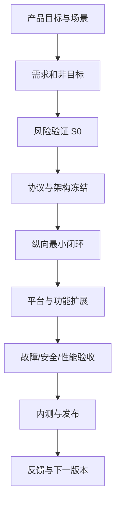

# NearSend Vibe Coding 开发流程

## 1. 目标

NearSend 可以使用多个 AI Agent 加速开发，但项目不能靠连续提示词“堆出来”。本流程把开发控制在可审阅、可测试、可回滚、可追踪的闭环中。维护者负责产品取舍和最终验收；Agent 只在任务卡授权范围内实现。

适用原则：

- 一次只让一个任务拥有明确边界、输入、输出与退出门槛。
- 协议、存储、安全和平台能力先验证，再扩展 UI 和功能面。
- 代码完成、测试通过、真机验收和发布可用是四个不同状态。
- 台账记录事实，不用主观百分比制造进度。

## 2. 全流程

### 阶段 A：问题定义

输出：一句话定位、核心用户旅程、MVP 范围、明确非目标、成功指标。

NearSend 当前核心场景为：无互联网、可无路由器时，在手机与电脑之间可靠互传大文件。首个产品闭环是 Android 与 Windows；iOS 关键风险提前验证、完整实现后接入。

门槛：不能只写功能清单，必须同时定义数据完整性、恢复、空间、权限和错误体验。

### 阶段 B：技术风险验证（S0）

优先验证最可能推翻设计的事项：热点与网络绑定、TLS pin、URI 重开与 seek、checkpoint 耐久性、iOS 生命周期、大文件内存与磁盘行为。

S0 产物只能标记“在给定环境验证”，不能直接标记产品能力完成。每项实验记录环境、步骤、输入、原始输出、结论和限制。

### 阶段 C：规格冻结

按顺序冻结：

1. 产品状态和错误体验。
2. 系统组件边界与依赖方向。
3. 协议字段、规范化、认证、幂等和恢复语义。
4. SQLite schema、迁移、checkpoint 提交顺序。
5. 平台能力接口和降级路径。
6. UI 状态模型、页面和关键文案。
7. 验收矩阵与发布阻断项。

“冻结”不是永不修改，而是后续修改必须带版本、兼容和迁移说明。

### 阶段 D：纵向最小闭环

先做 Android + Windows 的单文件、小文件、同一网络闭环：选择文件 → 配对 → 用户确认 → 流式传输 → 分块提交 → 整文件校验 → 导出 → 结果展示。此阶段不追求动画、多文件高级管理或自动组网。

闭环必须真实经过 UI、协议、网络、存储与平台适配，不使用跳过安全和持久化的演示捷径。

### 阶段 E：功能扩展

按风险而非页面数量扩展：断点恢复 → 多文件与部分失败 → Android 热点 → 反向传输 → 队列和空间管理 → iOS → 发布能力。

每次扩展保留原闭环测试，防止“新增一个平台，破坏已有平台”。

### 阶段 F：发布

候选版本必须具备：可复现构建、依赖锁定、签名、安装/升级/迁移验证、设备矩阵结果、发布说明、已知限制、包摘要和 Git 版本关联。

## 3. 台账驱动的日常循环

每个任务按以下状态流转：

| 状态 | 含义 | 允许动作 | 进入下一状态的证据 |
| --- | --- | --- | --- |
| 待澄清 | 范围或门槛不完整 | 补需求、做探索 | 任务卡完整 |
| 就绪 | 无前置阻塞，可领取 | 创建分支/工作树 | 负责人、基线 SHA、计划 |
| 进行中 | 正在实现 | 小步提交、同步风险 | 可运行的中间结果 |
| 待验证 | 实现完成但未达到全部门槛 | 自动测试、真机测试、评审 | 测试与证据链接 |
| 阻塞 | 外部条件或设计冲突阻止推进 | 记录阻塞与解除条件 | 阻塞被实际解除 |
| 已完成 | 退出门槛全部满足并合并 | 进入后续任务 | 合并 PR、证据、台账更新 |
| 已取消 | 需求取消或被替代 | 保留决策原因 | ADR/台账记录 |

更新规则：任务状态、下一动作、阻塞、证据四列必须一起检查；“Agent 说完成”不是证据。每个工作日或每个合并点更新一次即可，不需要为无变化制造提交。

## 4. 任务拆分方法

一张任务卡应在一个短生命周期分支中完成，并只影响一个主要风险面。推荐垂直切片，而不是先让不同 Agent 各自写完整网络层、完整 UI 层后再集成。

好的切片示例：

- `T01-01` 初始化 Flutter 工程并让 Android/Windows 启动同一个壳应用。
- `T02-01` 在 Dart 实现 canonical manifest 编码并通过固定向量。
- `T03-01` 完成二维码 pin 校验和一次性令牌交换的正负例。
- `T04-01` 写入一个块并在 durable sync 后提交 checkpoint。
- `T06-01` 空间估算器按卷输出可解释的需求明细。

过大的任务示例：“完成整个传输功能”“把 UI 全写完”“实现 Android/Windows/iOS”。

每张任务卡至少包含：任务 ID、目标、上下文链接、范围内、范围外、受影响接口、验收条件、必做测试、人工复核点、依赖和台账回填要求。

## 5. 多 Agent 协作规则

- 每个 Agent 使用独立分支；禁止多个 Agent 同时修改同一文件而没有明确协调。
- 共享协议、状态枚举、schema 与 Design Token 指定单一所有者；其他 Agent 通过接口消费。
- Agent 开工前读取基线 SHA 和相关文档；PR 合并前重新同步 `master` 并跑受影响测试。
- 一个 PR 只交付一个任务或紧密耦合的原子任务；不夹带全仓格式化和无关重构。
- 交接必须写“已做、未做、测试、风险、下一步”，下一位 Agent 不依赖聊天上下文猜测。
- 并行仅用于边界稳定的工作，如固定向量实现、独立平台探针、UI 组件 Story；核心协议仍按顺序冻结。

## 6. PR 与门禁

PR 描述至少包含：

1. 对应任务 ID 和规格章节。
2. 用户可观察到的结果。
3. 关键设计选择及未采用方案。
4. 实际执行的命令、环境和结果。
5. 未执行项与原因。
6. 安全、存储、迁移、删除相关人工复核提示。
7. 台账变更。

合并门禁：格式化、静态分析、受影响单测、协议固定向量、链接检查、敏感信息扫描必须通过；平台能力任务还需要指定设备证据。没有 Flutter 工程时必须如实写未执行，不能用文档检查冒充产品测试。

## 7. 变更控制

以下变化必须先更新设计并由维护者确认：

- 删除预扫描、分块校验、整文件终检或完整空间检查。
- 改变接收方 checkpoint 权威、同步顺序或 `lease_epoch` 仲裁。
- 修改认证方式、TLS pin 来源或令牌生命周期。
- 修改协议主版本、块大小、摘要算法、清单规范化或数据库 schema。
- 扩大 MVP 平台/角色范围、引入云端依赖或账号系统。
- 将平台受限能力描述为普遍可用。

## 8. 推荐里程碑

| 里程碑 | 关键交付 | 退出条件 |
| --- | --- | --- |
| M0 设计基线 | 文档体系、S0 台账、任务卡 | 文档互相链接，风险/未知项明确 |
| M1 工程基线 | Flutter Android/Windows 工程、CI | 两端可安装启动，检查可重复 |
| M2 协议冻结 | Dart 独立实现、固定向量、API 鉴权 | 正负例通过，版本规则明确 |
| M3 单文件闭环 | 同网配对与传输 | 校验一致、空间/错误 UI 可见 |
| M4 可靠恢复 | checkpoint、崩溃/重启恢复 | 不假完成、不重复导出 |
| M5 离线组网 | Android 热点 + Windows | 无上游网络完成真实传输 |
| M6 多文件与反向 | 队列、部分失败、双向角色 | 角色矩阵及小文件压力通过 |
| M7 iOS | 权限、生命周期、六方向 | 目标设备验收通过 |
| M8 内测发布 | 签名包、迁移、诊断、说明 | 无发布阻断项，外部用户可独立完成 |

## 9. 本流程的边界

此流程能降低 Agent 幻觉、集成冲突和假进度，但不能替代 Android、Windows、iOS 真机、签名环境和人工安全评审。NearSend 的主要风险来自平台网络与存储语义，最终结论必须由目标设备证据支持。
