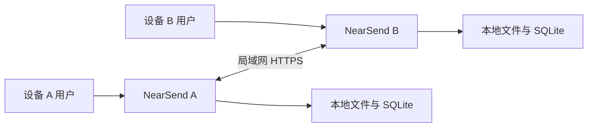
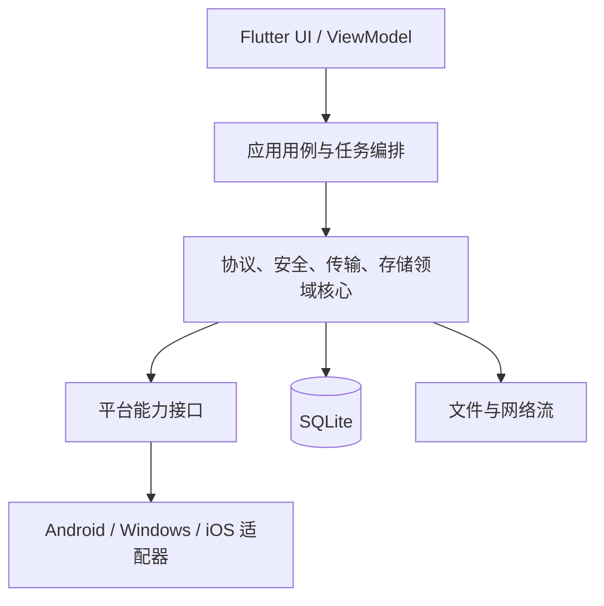

# NearSend 系统架构

状态：实施基线草案。协议和平台依赖在 S0 完成后冻结。

## 1. 架构目标

- 无互联网、可无路由器，通过本地 Wi-Fi 完成传输。
- Android、Windows、iOS 使用同一协议与一致的完整性语义。
- GB 级文件全程流式处理，内存占用与文件大小解耦。
- 中断、进程退出和设备重启后可安全恢复，不报告假完成。
- 初次配对抵抗局域网冒充；文件、日志和凭证最小暴露。
- 平台差异被隔离在适配层，业务规则不复制到三个端。

## 2. 系统上下文

NearSend 不存在中心云后台。每个客户端同时包含前台应用和按任务启动的本地端侧服务。连接角色（谁监听端口）与文件方向（谁发送）相互独立。

端侧“服务端”只在本地网络监听，为当前配对/任务提供 API；它不是部署在互联网的数据后台。未来可选的更新检查和反馈服务不得成为核心传输依赖。

## 3. 容器与分层

### UI 层

负责页面、导航、可访问性、状态展示和用户意图。UI 不直接发 HTTP、不拼协议 JSON、不执行文件哈希、不写 SQLite。

### 应用层

实现 `PrepareTransfer`、`PairDevice`、`AcceptTransfer`、`RunTransfer`、`PauseTask`、`ResumeTask`、`ExportResult`、`CleanupTask` 等用例；协调领域服务并把细粒度状态映射为可展示状态。

### 核心层

包含唯一的协议模型、canonical 编码、状态机、安全策略、分块调度、背压、哈希、空间计算、checkpoint 和导出事务。核心层依赖抽象端口，不依赖 Flutter Widget 或具体平台 API。

### 平台适配层

封装 Android `Network`/热点/SAF、Windows 网络与文件选择、iOS 本地网络/Bonjour/安全作用域资源、平台安全存储、通知和电源生命周期。

## 4. 核心组件

| 组件 | 职责 | 不负责 |
| --- | --- | --- |
| Task Orchestrator | 串联任务状态、重试、暂停和取消 | 实际 UI 渲染 |
| Discovery | mDNS/Bonjour 发布与查询 | 设备身份信任 |
| Pairing & Trust | QR 解析、TLS 指纹绑定、一次性令牌、设备授权 | 自动信任发现结果 |
| Local API Server | HTTPS 路由、鉴权、限流、幂等 | 长期互联网服务 |
| Protocol Client | 能力协商、清单、块、状态与恢复请求 | 直接操作页面 |
| Transfer Engine | 有界并发、流式收发、背压与调度 | 决定用户是否接受任务 |
| Manifest Service | 文件枚举、规范化、预扫描、摘要 | 把不可重开 URI 假装成普通路径 |
| Checkpoint Store | durable 块状态、世代、请求幂等 | 用进度字节数替代提交事实 |
| Storage Manager | 暂存、空间估算、导出、清理 | 删除任务外文件 |
| Diagnostics | 结构化日志、指标、用户导出 | 上传敏感内容或令牌 |

## 5. 依赖方向

- `features → core → ports`；平台适配实现 `ports`。
- `core` 不依赖 `features`、Widget、MethodChannel 或具体数据库包的 UI 绑定。
- 协议 DTO 与领域对象分离，避免网络可选字段污染内部不变量。
- SQLite 访问集中在 repository/transaction 边界，不由页面各自执行 SQL。
- 平台插件返回能力和错误，不包含传输业务状态机。

## 6. 关键数据流

### 新任务

1. 发送方获取用户文件授权并扫描来源能力。
2. Manifest Service 流式读取并生成冻结清单、分块与摘要。
3. 接收方展示清单，按卷计算暂存和导出峰值，用户确认。
4. 双方完成 TLS 指纹验证、一次性令牌提交和能力协商。
5. 接收方创建任务、暂存目标和写入世代。
6. Transfer Engine 请求缺失块；每块校验后写入。
7. 数据 durable sync 成功后，在 SQLite 事务中提交块状态。
8. 所有块提交后执行整文件终检，再导出到用户位置。
9. 导出结果持久化后才展示完成；失败可从保存阶段重试。

### 恢复任务

1. 接收方加载冻结清单和 committed 块，它是唯一权威。
2. 先向用户展示“正在检查已接收内容”。
3. 抽查或全量校验本地块；损坏块退回 missing。
4. 接收方提升 `lease_epoch`，拒绝旧恢复流程的写入。
5. 双方协商缺失集合，只重传缺失块。
6. 终检和导出仍按新任务相同门槛执行。

## 7. 状态模型

任务领域状态建议固定为：

`draft → preparing → awaiting_connection → awaiting_acceptance → transferring ↔ paused → verifying → exporting → completed`

任何非终态都可进入 `failed_recoverable`、`failed_terminal` 或 `cancelled`，但状态迁移必须由明确事件触发。网络瞬断不直接删除任务；“完成”必须满足所有选中文件已终检且导出结果已提交。

单文件状态与任务状态分离，允许多文件任务部分失败。文件至少区分 `pending/preparing/transferring/verifying/exporting/completed/failed/skipped`。

## 8. 持久化模型

建议 schema 实体：

| 实体 | 关键字段 | 约束 |
| --- | --- | --- |
| tasks | task_id、角色、状态、协议版本、lease_epoch、checkpoint_seq、manifest_hash | 状态迁移、世代与 checkpoint 原子更新 |
| peers | peer_id、身份指纹、授权状态 | 敏感凭证不明文写入 |
| files | file_id、规范化路径、大小、块大小、file_hash、export_state | 清单冻结后不可静默修改 |
| chunks | file_id、index、offset、length、hash、state | `(file_id,index)` 唯一；committed 为恢复权威 |
| idempotency | request_id、operation、result_digest、expires_at | 重放返回同一语义结果 |
| exports | file_id、目标句柄、结果、时间 | 防止重复导出和误删 |

实际 SQL、索引、WAL 参数和迁移脚本由独立 schema 设计任务冻结。升级前对 SQLite 做一致性备份，不能只复制活跃 WAL 的主文件。

## 9. 并发与资源模型

- 文件读取、哈希、网络和落盘在后台 isolate/原生线程执行。
- 使用固定数量的块窗口和有界队列；接收端磁盘速度通过背压限制发送端。
- 默认逻辑块 4 MiB，属于协议版本参数；调整前必须重新生成向量和兼容说明。
- 同一任务只允许一个 active receiver lease；同一文件块不可被两个 writer 并发提交。
- 暂停停止请求新块，允许已接收块走完校验和持久化；尽量保留连接，但不承诺平台后台无限存活。
- 取消撤销任务授权并停止新写入，不删除已成功导出的文件。

## 10. 安全边界

信任边界包括二维码/手动输入、局域网连接、平台文件选择器、暂存目录、导出目标和诊断包。

核心控制：

- 在提交任何凭证前验证二维码提供的证书公钥/证书指纹。
- 一次性令牌至少 128 位随机，限制用途、方向、时间和使用次数。
- 每个 API 同时验证任务、设备、方向、文件、块范围、摘要和世代。
- 规范化相对路径，拒绝绝对路径、`..`、保留名、非法 Unicode 和任务外覆盖。
- 私钥/恢复凭证进入平台安全存储；日志只记录截断标识和错误码。
- 完整性失败不得降级为警告后继续完成。

## 11. 可观察性

每个任务生成本地 `trace_id`，日志事件包含时间、版本、阶段、任务短 ID、错误码、块计数和耗时，不包含令牌、密钥、完整文件名/清单或内容。

核心指标：连接耗时、准备耗时、网络传输耗时、终检耗时、导出耗时、吞吐量、重试数、重传字节、checkpoint 批次、峰值内存、空间估算与实际占用差异。

## 12. 尚待 S0 冻结的选择

- Flutter/Dart TLS 与 Android 指定 `Network` 的组合路径。
- 端侧 HTTPS server/client 的具体依赖和 TLS 1.3 支持矩阵。
- SQLite 插件、后台 isolate 与平台 durable sync 行为。
- Windows 自动组网能力与最低系统版本。
- iOS 前后台、Bonjour、Local Network 权限与 security-scoped URL 的恢复边界。

在这些结果产生前，架构只冻结接口和安全语义，不虚构具体库或系统能力。
