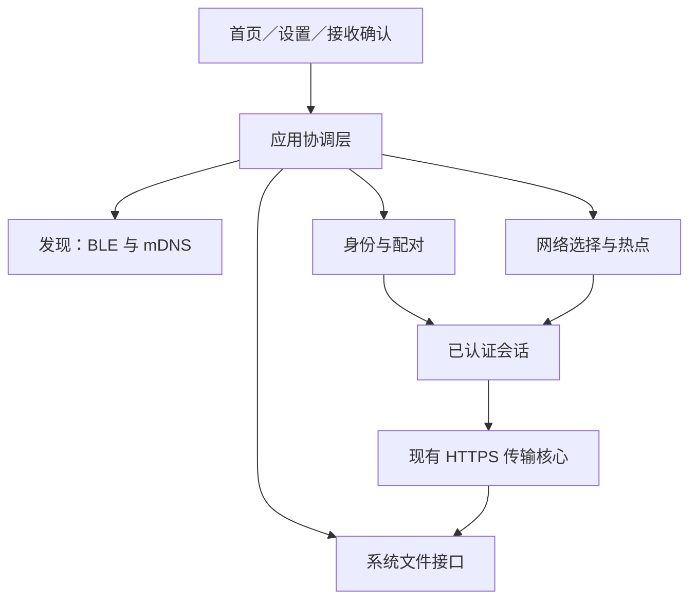
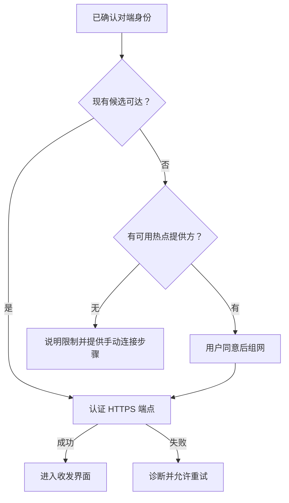

# NearSend 1.2 升级开发文档

版本：1.0（开发执行稿）  
编写日期：2026-09-24  
目标：完成保存位置设置、逐次接收确认、附近设备雷达、可信配对历史、二维码配对和系统文件管理接入。  
适用执行者：Codex 与项目开发者。

> 本文规定的是待开发的 1.2 升级，并不表示这些功能已经完成。代码基线为 `yanzhao77/NearSend` 的 `master`，提交 `ae4a2db3c86963e07376d9521d606de0090859eb`。结论来自代码与官方资料检查，没有替代 Android／Windows 双机实测。执行时先检查实际分支的新变化，再适配本计划。产品版本、网络协议版本和数据库版本分别管理，不能统一改成“1.2”。

## 1. 必须交付的产品行为

| 编号 | 需求 | 完成标准 |
|---|---|---|
| R01 | 设置默认接收位置 | 通过系统目录选择器设置，重启后仍有效；权限失效时可重新选择 |
| R02 | 每次接收确认 | 接收文件内容前弹出文件名和保存位置确认；默认发送方文件名＋设置中的默认目录 |
| R03 | 雷达就绪开关 | 首页点击开启 NearSend 就绪，再次点击关闭；提供真实启停、权限失败和网络状态反馈 |
| R04 | 附近设备与配对 | BLE 可发现不在同一 Wi-Fi 的兼容设备；mDNS 补充局域网发现；点击后完成身份确认和双向配对 |
| R05 | 历史配对 | 已配对设备持久显示；当前已验证就绪的设备显示绿色呼吸灯，其余不显示状态灯 |
| R06 | 二维码与扫码 | 扫码进入同一配对流程；支持已有网络和需要热点组网两类情形 |
| R07 | 系统文件管理 | 选择发送文件、接收目录、打开文件与显示所在位置使用平台接口，不开发自有文件浏览器 |
| R08 | 文件收发 | 配对完成后两端都可以发送和接收；大文件通过可用 Wi-Fi 数据通道传输 |

这里的“附近”是：**物理附近、运行兼容 NearSend、已开启就绪且能通过支持的发现方式找到的设备**。不能把“连接同一个 Wi-Fi”作为发现或配对的前提；也不能承诺任意未安装 NearSend 的设备都能被发现和传文件。

1.2 首要完整验收组合是 Android 与 Windows 10/11。Android 与 Android 复用同一架构并列入测试。Windows 与 Windows 在同一可达网络下支持收发；无共同网络时不能假设任一电脑一定能创建热点。iOS、macOS、Linux 保留现有功能和可编译性，新增能力按照实际适配器报告；没有完成实机验证的平台不能宣传具有同等离线组网能力。如需把这些平台也作为 1.2 全功能发布目标，应扩展相应原生适配任务和验收设备，而不是以占位实现标记完成。

### 1.1 本次不顺带扩大范围

- 不增加云中转、账号体系或互联网远程传输。
- BLE 用于发现、可信配对和少量组网信息，不作为大文件主传输通道。
- Wi-Fi Direct、Wi-Fi Aware、iOS 专属点对点通道可留作后续适配，不能充当本版尚未实现的通用方案。
- 不把已有“暂停／恢复”界面当作端到端恢复已经完成；本次保留既有协议与任务行为，只补齐升级必需的持久化和错误处理。

## 2. 先解释清楚几项技术

### 2.1 mDNS、DNS-SD 和 bonsoir 是什么

普通 DNS 往往需要 DNS 服务器。mDNS 在本地链路上通过多播询问“谁提供某服务”；DNS-SD 定义服务名称、类型、端口和 TXT 属性等发现信息。NearSend 可以发布一个服务，其他设备发现后取得候选地址，再真正连接验证。

`bonsoir` 是 Flutter 的服务发现插件，封装各平台相应的服务广播和发现能力，减少分别编写 Bonjour／NSD 等代码的工作。它**不是蓝牙插件，不负责安全配对，也不是文件传输引擎**。多播通常不能跨路由网络，访客 Wi-Fi、AP 隔离或防火墙还可能阻止同一 Wi-Fi 内的设备互访。因此它只是一条发现渠道。

实施时优先验证 `bonsoir`，服务类型拟定为 `_nearsend._tcp`；最终名称、TXT 字段和版本在协议文档中冻结。只有 HTTPS 服务成功监听、设备确实就绪以后才能发布。不能先显示“已就绪”再忽略监听失败。

### 2.2 蓝牙验证之后用什么发送文件

使用设备的 Wi-Fi 网络接口，通过现有安全文件传输协议发送：

| 情形 | 发现／身份确认 | 文件数据通道 |
|---|---|---|
| 已有相互可达的网络 | BLE 或 mDNS，之后完成可信认证 | 当前网络上的 HTTPS |
| 两端连接不同 Wi-Fi | BLE 或二维码 | 优先让 Android 建立本地热点，另一端加入，再走 HTTPS |
| 两端没有路由器或互联网 | BLE 或二维码 | Android 本地热点组成局部网络，再走 HTTPS |
| 同一 Wi-Fi 但 AP 隔离／防火墙阻断 | 可能发现成功，连接验证失败 | 尝试热点，或给出具体的网络修复步骤 |
| BLE 不可用／被拒绝 | 扫码，已有网络也可 mDNS | 可达网络或用户确认加入的热点 |

热点提供方与发送方没有绑定关系。例如 Android 接收、Windows 发送，也可以由 Android 提供热点。**无需互联网不等于无需建立数据网络；蓝牙配对成功不代表 HTTPS 已经可达。**

### 2.3 应用配对与系统蓝牙配对不同

NearSend 配对建立的是应用中的设备信任。不能用“系统蓝牙已配对”、设备名称相同、MAC 地址相同或同一 Wi-Fi 来替代身份认证。BLE 广告可以被仿冒；设备名称和网络地址只能用于发现与展示。

## 3. 当前代码基础与改造边界

执行前阅读仓库的 `AGENTS.md`、`docs/PROJECT_LEDGER.md`、`docs/protocol/v1.0-draft1.md`、`docs/ui/STYLE_GUIDE.md`、`docs/ui/UI_UX_SPEC.md` 和相关任务文档。以下是基线下已经存在、应优先扩展的部分：

| 现有位置 | 当前作用／差距 | 升级方式 |
|---|---|---|
| `lib/app/application/app_settings_repository.dart` | 已有 `defaultReceiveLocation`、主题、减少动画等设置 | 演进为平台位置引用；保留旧设置迁移 |
| `lib/platform/platform_storage_gateway.dart` | 平台存储能力入口；Android 目录选择尚未完整接入 | 增加 SAF 目录授权、目标创建、持久权限、可用空间能力 |
| `lib/core/storage/peer_repository.dart` | 已有指纹、授权、撤销、最后见到时间 | 增加历史查询、稳定身份与新配对状态；不存明文密钥 |
| `lib/core/security/pairing_payload.dart` | 现有 `lft-pair` JSON 严格校验字段，包含候选地址、TLS 指纹、短期令牌 | 保留旧解析器；新增版本化引导载荷解析器，不能随意塞未知字段 |
| `lib/core/security/pairing_service.dart` | 已有短期一次性配对令牌及会话，能力协商尚需扩展 | 分开“首次配对”“已信任设备再认证”“传输会话” |
| `lib/core/transfer/near_send_node.dart` 等 | 有安全传输核心；当前身份初始化需要检查持久化问题 | 复用传输和块提交规则，补持久身份及端点绑定 |
| `lib/features/transfer/application/` | 收发流程、会话和接收服务 | 插入接收确认与本地输出计划，不复制第二套传输逻辑 |
| `lib/core/storage/export_service.dart`、`export_naming.dart` | 文件导出和名称处理 | 扩展到目标路径／文档 URI，并处理冲突与取消 |
| `lib/features/settings/presentation/settings_page.dart` | 设置入口 | 接入系统目录选择、可访问性验证和权限修复 |
| `lib/features/home/presentation/home_page.dart` | 首页入口 | 增加就绪开关、发现列表和配对历史 |
| `android/.../MainActivity.kt`、`windows/runner/` | 已有原生桥接基础 | 拆分 BLE、网络、存储服务，避免把全部业务堆进 Activity／窗口类 |

路径如已重构，以实际等价模块为准。不要为追随本文目录名称重复建一套业务层。

## 4. 总体架构



### 4.1 分层职责

| 模块 | 职责 | 禁止承担的职责 |
|---|---|---|
| `ReadinessController` | 就绪启停、权限、资源所有权和界面状态 | 直接操作文件分块或拼装加密协议 |
| `DiscoveryCoordinator` | 合并 mDNS／BLE 发现事件、超时、来源显示 | 将未经验证的广告写成可信设备 |
| `IdentityService` | 稳定身份、密钥保存、签名证明、身份重置 | 使用 IP／MAC 当永久设备 ID |
| `PairingCoordinator` | 邀请、用户确认、认证、双向提交、撤销 | 因为“历史里有记录”就跳过对端证明 |
| `NetworkBootstrapCoordinator` | 检查可达候选、选择热点方案、连接和释放 | 仅比较 SSID 就认定网络可用 |
| `SessionCoordinator` | 绑定认证身份与实际 HTTPS 端点，维护会话 | 接受所有证书或保存长期明文配对令牌 |
| `ReceiveDecisionController` | 排队接收邀请、编辑文件名与位置、生成输出计划 | 在用户确认前开始接收内容 |
| `PlatformFileGateway` | 系统选择器、位置权限、流式读写、打开／定位 | 编写自有文件管理器 |

建议以接口注入各平台实现。BLE、mDNS、网络、文件操作均返回能力和结构化错误；UI 根据实际能力显示可用操作，不能用空实现返回成功。

### 4.2 状态需要分别维护

不要用一个 `connected: bool` 代表全部流程：

- 就绪：`off → starting → ready → stopping → off`，失败进入可重试 `error`。
- 发现：`seenUnverified / verifiedReady / stale`。
- 信任：`unknown / pairingPending / paired / revoked / identityChanged`。
- 网络：`unavailable / checking / needsJoin / connecting / reachable / failed`。
- 传输：继续使用现有任务状态，接收内容前增加 `awaitingUserDecision` 或等价状态。

“已配对，正在建立传输网络”是正常状态；不要提前显示“可以传输”。发现到未配对设备也不能点亮历史设备的绿灯。

### 4.3 生命周期与并发

- 同一设备只维护一个就绪实例、一个受控发现协调器；重复点击和重复生命周期回调应幂等。
- 两端同时点击配对时，按双方临时会话标识的确定性排序选出协调方，合并成同一邀请，不弹两套确认。
- 邀请、文件确认使用有上限的队列，最多一个前台模态对话框。取消邀请清除对应状态，不影响其他任务。
- 关闭就绪停止广播、扫描和新邀请。存在传输时询问“传完后关闭”或“取消传输并关闭”，不能悄悄中断。
- 默认每次启动为未就绪；配对历史保留。若以后增加自动就绪设置，单独征得用户开启。
- 后台支持应以真实系统能力为准。Android 长时间可见服务使用符合目标 SDK 要求的前台服务与通知；被系统杀死后不能仍宣称在线。

## 5. 系统文件接口与保存位置

### 5.1 位置引用，不是所有平台都有文件路径

定义可版本化的 `StorageLocationRef`：

| 字段 | 含义 |
|---|---|
| `kind` | `nativeDirectory`、`androidDocumentTree`、`appPrivate` 等 |
| `opaqueValue` | 原生路径或平台文档 URI，仅交给对应平台解释 |
| `displayName` | 给用户看的目录名称／简化地址 |
| `permissionState` | 运行时检查所得，不作为永久有效的承诺 |
| `schemaVersion` | 引用格式版本，支持旧设置迁移 |

Android 的 `content://` 不能传给 Dart `File(path)`；云文档提供方也不一定能离线使用或准确返回剩余容量。平台接口要表达 `supported / unsupported / permissionDenied / unavailable / unknown`，不能把“未知剩余空间”当成 0 或无限。

建议扩展现有存储接口，提供：选择发送文件、选择接收目录、校验位置、创建接收目标、流式写入、提交／清理目标、打开文件、显示位置。返回的平台句柄包含可读显示名与不透明引用，避免业务层拼接 URI。

### 5.2 Android

- 发送文件使用 `ACTION_OPEN_DOCUMENT`／现有系统选择器；接收默认目录使用 `ACTION_OPEN_DOCUMENT_TREE`。
- 只保存系统实际授予且支持持久化的权限，调用 `takePersistableUriPermission`；每次使用前检查并处理被撤销情况。
- 通过 `ContentResolver`／`DocumentsContract` 在树下创建、读写、必要时重命名文档，原生桥接采用流式方式。
- 不申请 `MANAGE_EXTERNAL_STORAGE` 来绕过系统选择器。Android 11 起部分根目录、Download 根目录与受限路径的选择行为有约束，界面以系统实际返回为准。
- 第一次接收可以使用当前应用默认位置，但必须清楚展示；若产品期望用户可直接在文件管理器中看到，优先引导用户选外部授权目录。
- 打开文件使用带临时读取授权的 Intent／安全 URI，不暴露 `file://`；显示目录如提供方不支持，给出“打开文件”或系统文档界面入口，不伪造成功。
- 导出到文档提供方时通常不能保证 POSIX 原子重命名。接收先落到应用受控暂存区并完成校验，再以明确的“保存中”状态导出；支持时使用临时名＋重命名，不支持时处理可见未完成文件并仅清理本任务创建的对象。

### 5.3 Windows

- 优先验证 Flutter 官方 `file_selector`，使用系统文件／文件夹选择对话框；能力不满足再补原生接口。
- 默认目录使用系统已知文件夹 API 获取，不能硬编码用户名或 `C:\\Users` 路径。
- 文件打开／所在位置使用系统 Shell API；不要把文件名拼成 shell 命令。
- 支持 Unicode、长路径能力、移动盘断开、网络盘不可达、目录删除与权限变化。
- 本地文件系统优先同卷临时文件＋完成后原子提交；跨卷导出按流式复制和失败清理处理。

### 5.4 每次接收的准确流程

1. 对端已经通过会话认证，发送有界文件清单／接收邀请；此时允许元数据，不允许文件内容流入。
2. 本机显示发送设备、文件数量、总大小、每个文件的原始名与可编辑保存名、目标目录。
3. 默认目录取设置；本次修改只作用于本次接收。只有勾选“设为默认保存位置”时更新设置。
4. 单文件显示一个文件名输入框；多文件一个确认弹框，逐项可改名，不逐文件连续弹窗。目录选择使用系统接口。
5. 验证文件名、目录权限、空间与冲突，创建并持久化 `ReceiveOutputPlan`，随后发送接受响应。
6. 拒绝／取消／超时发送结构化结果，发送方结束等待；没有响应不能当作同意。
7. 接收暂存、完整性校验、导出提交全部成功后才能显示“已保存”。传输完成但导出失败应保留可重试状态和有效暂存数据。

发送方显示“等待对方确认”，建议等待上限 5 分钟并允许取消；具体超时写入协议，双方统一。设置可信设备不取消逐次接收确认。

### 5.5 本地输出计划与名称安全

`ReceiveOutputPlan` 以 `transferId + fileId` 关联：原始名、用户选择名、目标位置引用、冲突策略、最终创建句柄、导出状态。发送方清单、文件 ID、哈希和恢复语义保持不可变，用户改名只改变本地输出映射。

- 拒绝绝对路径、`..` 穿越、NUL、控制字符与平台非法名称；远端名称只作为建议的单个名称，不能作为目标路径。
- 处理 Windows 保留名、末尾空格／句点、大小写不敏感冲突、Unicode 与长度上限。名称规范化后再检查冲突。
- 默认自动增加后缀，例如 `报告 (1).pdf`；使用排他创建处理竞态，不能只靠之前的“是否存在”检查。
- 本版不提供静默覆盖。若以后支持覆盖，需要单独明确确认和安全替换逻辑。
- 失败重试复用本任务的输出记录，避免重复创建多份文件；崩溃恢复只能删除或继续处理确认属于本任务的临时对象。
- 延续现有块校验、落盘与数据库提交顺序；不得为系统文件接口改造破坏“块落盘后再提交已接收状态”的规则。

## 6. 雷达与多通道发现

### 6.1 首页交互

首页增加雷达图标／按钮，文字为“开启就绪”或“设备已就绪”。点击控制 NearSend 服务，不表示关闭系统 Wi-Fi／蓝牙。下方依次显示附近设备列表、已配对设备列表；可复用项目既有视觉规范，不新增无关导航。

附近设备展示名称、平台、发现方式和当前动作：配对、连接、发送或重试。RSSI 只能作为粗略排序辅助，不能显示未经校准的“距离 2 米”。首次发现身份尚未验证时不能把攻击者广播的名字当成已认证名称。

历史列表按稳定身份去重，显示设备名称、最后连接时间、连接／发送和忘记设备操作。只有完成该已知身份的新鲜挑战并确认处于就绪状态后才亮绿色呼吸灯。其他状态不出现任何颜色的灯；可用文字解释“未就绪”“连接失败”等。开启减少动画时用静态绿点代替呼吸动画。

### 6.2 mDNS 实现

- `bonsoir` 负责发布与浏览；TXT 仅包含协议版本、功能位、临时实例标识等最少公开信息。
- 不广播私钥、配对令牌、热点密码、文件列表和接收路径。
- 收集多网卡候选与 IPv4／IPv6 地址；处理服务更新、接口变化、地址失效和 IPv6 链路本地 scope。
- 对候选端点执行受控连接与认证，限并发、限时，避免每次列表刷新都启动大量连接。
- mDNS 发现失败不影响 BLE／扫码；服务消失立即清除该来源，是否离线还需看其他有效来源。

### 6.3 BLE 实现

第一阶段先验证 Android ↔ Windows 的双向 GATT 控制通道，再做界面。Flutter BLE 插件必须实际验证扫描、广播、GATT 服务端及 Windows 支持，不能只看“支持蓝牙”几个字。需要时建立项目内原生插件：Android Kotlin＋Windows WinRT C++，公共 Dart 接口保持一致。

BLE 广告只放服务标识、协议概要和短期实例 ID；受传统广告约 31 字节预算约束，不能默认把完整名称、完整公钥和长 JSON 全塞进去。设备详情通过 GATT 获取，广告 ID 定期更新并在关闭后废止。

控制消息包含格式版本、消息类型、会话 ID、序号和长度。根据实际 MTU 分片重组，建议逻辑消息总上限 16 KiB，并设置片数、超时和并发上限。拒绝重复／越界／乱序导致的无限缓存；大文件永不走该通道。

Windows 必须检测蓝牙适配器的广播／外设能力。优先允许 Android 广播、Windows 扫描连接，随后利用双向控制通道让双方列表互相出现和接受邀请；这不要求每台 Windows 都能做外设。没有必要能力时显示具体原因，并保留二维码入口。Android 之间也应协商角色、消除双连接。

### 6.4 去重、在线与消失

- 发现阶段按来源临时 ID 暂存；认证后根据稳定设备身份合并 BLE、mDNS 和二维码产生的候选。
- IP 地址变化不新增历史设备；同名设备不能自动合并。
- 已知设备在线证明必须绑定本次随机挑战、就绪状态及有效期，防止重放旧响应点亮绿灯。
- 初始建议：活跃页面每 10 秒刷新轻量认证心跳，连续失败或 30 秒无有效证明后移除绿灯；系统明确收到关闭／断开事件则立即更新。节能和后台策略可以调整，但参数必须集中配置并有测试。
- BLE 已验证就绪但网络仍在建立时可以亮绿灯，同时明确显示“连接网络后可传输”。绿灯的定义是“该身份当前就绪”，不是速度或 HTTPS 可达性保证。
- 只广播“在线”、没有完成身份验证的历史匹配设备不能亮灯。

## 7. 持久身份、安全配对与历史

### 7.1 稳定身份

检查现有节点初始化：重启时不能重新生成身份造成每次都像陌生设备。建立长期设备身份密钥，设备 ID 从其公钥的明确规范化表示导出。设备名称独立可改。

长期身份与具体 TLS 证书分开建模。可以复用现有证书固定验证能力，但首次或更新端点时必须把 TLS 证书指纹绑定到已经认证的长期身份；绑定声明包含身份、指纹、会话挑战、协议版本和有效期。证书续期不等于设备身份变化；无法证明连续性的长期身份变化必须重新确认配对，禁止静默接受新指纹。

私钥与长期凭证由平台安全存储保护，SQLite 仅存引用、公钥和非秘密元数据。可评估 `flutter_secure_storage`，但要区分“原生不可导出密钥”和“由系统保护存储、使用时进入进程内存的 TLS 私钥”；按 TLS 库实际能力实现，不做无法兑现的安全宣传。日志、崩溃报告、二维码调试输出不得包含秘密。

### 7.2 雷达首次配对

推荐采用标准 PAKE 短码配对：接收邀请一端显示一次性短码，发起端输入，然后通过经过审计的 SPAKE2／SPAKE2+ 等标准实现证明双方持有同一短码，并完成密钥确认。这样短码不是在 BLE 上直接明文发送的“密码”。禁止自行拼一个哈希比对协议或直接用短码加密热点密码。

开发任务 V12-00 必须选择可在目标平台运行、许可合适且有测试向量的实现，记录版本和封装边界。若没有可用实现，必须明确报告该路径未完成，继续推进不依赖它的功能；不能以不安全的简化方案假装完成雷达配对。二维码高熵引导仍可独立交付，但不能替代雷达点击配对的验收。

流程：

1. A 点击 B；B 接受邀请，显示发起方信息及一次性短码。
2. A 输入 B 的短码；通过标准 PAKE 握手和密钥确认建立受保护控制会话。
3. 在认证通道内交换双方长期公钥、能力及网络候选；将角色、随机挑战、协议版本和身份绑定到认证过程，防止反射与降级。
4. 双方显示对端信息并完成确认，持久化配对记录；通过带幂等事务 ID 的双向确认协议解决一侧落库后掉线的问题。
5. 通过同一受保护通道交换所需热点信息，建立数据网络，验证实际 HTTPS 对端与刚才的身份绑定一致。

建议短码为 8 位数字、有效期 120 秒，每次邀请最多 5 次失败并加退避；实现需要额外设备／进程级限速，不能让攻击者换邀请无限猜码。随机数、派生、AEAD、nonce 管理由成熟库负责。最终密码套件和字节编码必须形成 ADR 与互操作测试，不能让两个平台各自理解一套。

### 7.3 已配对设备再次连接

重新出现后用持久身份完成双向挑战认证，并建立新的短期会话。**配对信任可以长期保存，网络会话必须短期且可撤销**；不能把旧的一次性 `pairToken` 保存下来反复使用。

已配对不等于允许自动接收文件，仍执行 R02。对端撤销或本机忘记设备后，新邀请必须重新配对。单端“忘记”不能保证离线另一端同步删除，但本端必须立即拒绝旧信任建立新会话；在线时可发送经过认证的撤销通知。

身份恢复与重装作为独立情况：安全存储丢失、DB 还在时不重新生成相同 ID 冒充旧身份；标记本机身份重建，要求相关设备重新配对。

### 7.4 数据模型与迁移

扩展现有表，不重复建设互相矛盾的信任表：

| 数据 | 持久字段建议 | 注意 |
|---|---|---|
| 本机身份元数据 | deviceId、公钥、密钥引用、创建时间、格式版本 | 私钥不入 SQLite |
| 已配对设备 | peerId、公钥、显示名、平台、信任状态、配对时间、最后验证时间 | 不把广告名称覆盖成已认证名称 |
| 配对事务 | transactionId、双方身份、阶段、过期时间、凭证引用 | 支持确认丢失和崩溃恢复 |
| 接收输出计划 | transferId、fileId、目标引用、保存名、创建句柄、导出状态 | 绑定旧任务恢复规则 |
| 设置 | 版本化默认目录引用 | 从旧字符串迁移，无法解析时保留修复入口 |

在线状态放内存，应用重启后全部重新验证。不要持久化 `isOnline=true`。数据库与安全存储不能假装具有跨系统原子事务：先写阶段／引用，再完成对应安全存储操作，启动时对未完成记录做幂等协调，清理孤儿引用。

## 8. 网络选择与离线热点

### 8.1 网络决策



候选探测使用有时限的实际服务连接；SSID 相同、能 ping 通、蓝牙连接成功都不能替代。限制候选数量与地址类型，避免恶意载荷使应用任意探测公网／本机敏感端口；用户可见的手动地址能力如现有协议保留，应单独校验并限制认证数据泄露。

热点候选优先选择可用 Android 主机，发送与接收角色不影响选择。只在确实需要时创建热点；不要启动就绪就强制切换用户网络。

### 8.2 Android LocalOnlyHotspot

- 使用官方 LocalOnlyHotspot API，在权限满足、系统允许时建立仅本地通信的热点；它不提供互联网接入。
- 持有系统返回的 reservation，按真实回调处理启动成功、失败和释放，不能预先假定 SSID／密码／IP。
- 热点凭据通过已经认证的 BLE 控制通道，或用户明确展示的短期二维码传递。
- 组网前提示“可能切换当前 Wi-Fi，原网络中的连接可能中断”；允许用户拒绝并选择手动网络。
- Android 作为加入方时评估系统 Wi-Fi Network Request API 等受支持流程，保留系统确认；不能承诺所有版本都能静默加入。
- 接入无互联网 Wi-Fi 时，系统可能仍将默认出站路由放到蜂窝网络。必须实测 HTTP 客户端／服务端与目标 Network／网卡的绑定行为。
- 在 V12-00 中证明现有 Dart 网络栈的绑定方案；若需要原生 socket 桥接，应封装在传输适配层。进程级网络绑定会影响整个应用，只有验证副作用和恢复逻辑后才能使用。
- 无论哪一种方法，都不能在本地候选失败时自动把文件发到公网地址或云中转。

### 8.3 Windows 加入热点

检测 Wi-Fi 适配器及连接能力，优先通过 Native Wi-Fi API 创建受控临时连接配置并调用连接接口；等待实际 WLAN 事件，再验证 IP 和 HTTPS 服务。系统权限、策略或驱动不允许时，打开系统 Wi-Fi 设置并给出手动步骤。

不要把 SSID／密码拼进 `netsh` 命令行或输出日志。临时配置的生命周期必须可追踪，结束后按用户选择恢复之前连接；恢复只能尽力执行，失败要提示，不得删除用户原有配置。记录本次创建的配置 ID，仅删除属于 NearSend 的临时配置。

Windows 入站服务可能受防火墙影响，提供清晰应用放行指引；不自动关闭防火墙，不默认申请管理员权限。

### 8.4 释放与错误

热点由资源管理器引用计数，活跃传输仍使用时不能提前关闭。传输结束后允许短时间保留便于反向发送，最终按就绪状态和空闲超时释放。所有超时集中配置并可测试。

错误需要区分：没有硬件、权限拒绝、热点不受支持、系统忙、用户取消加入、连接超时、取得网络但服务不通、证书／身份不匹配。身份不匹配不得退回“不验证证书”的连接。

## 9. 二维码展示与扫码

### 9.1 两种引导模式

| 模式 | 场景 | 二维码内容方向 |
|---|---|---|
| `reachableNetwork` | 对端可加入／已在可达网络 | 协议版本、短期引导 ID、高熵一次性秘密、身份／端点绑定信息、候选地址 |
| `networkBootstrap` | 没有共同网络，二维码补充雷达 | 上述安全引导信息＋当前有效热点的 SSID、安全类型、密码或受保护获取方法 |

不能只把一个私网 IP 放进二维码，然后宣称不同 Wi-Fi 下也能连上。显示 `networkBootstrap` 二维码前，必须确认热点已经成功建立；扫码后先引导加入网络，再认证配对。

二维码可携带 256 位密码学随机秘密作为带外引导，绑定一次邀请、角色和身份，有效期建议 120 秒且一次使用。热点密码出现在该模式二维码中属于用户主动展示的敏感信息：界面说明“附近看到此码的人可能加入临时网络”，不得写入日志、历史或分析数据，取消／到期时撤销邀请；网络密码若尚未实际轮换，不能声称旧图片已经失去 Wi-Fi 加入能力。文件访问仍需应用认证和接收确认。

QR 不自动信任发送端名称；扫码后展示目标并由双方确认，连接必须验证二维码绑定的身份／证书。二维码中的 URL、路径和候选地址不允许自动交给系统执行。

### 9.2 版本与兼容

现有 `lft-pair` 解析器严格限制字段，保留不动或以明确兼容测试修改。新增 `nearsend-bootstrap` 类型与独立 `formatVersion`，先按类型分发，再严格校验字段、长度、协议版本、候选数量、令牌和过期状态。有效期以发行方实际存活邀请为最终依据，不能仅信任扫码方墙上时钟。

旧版二维码继续用于旧协议支持的可达网络配对；不让旧解析器猜测新热点字段。不能理解新版载荷时提示升级，不崩溃、不降级绕过身份校验。

### 9.3 平台能力

- 展示可优先用 `qr_flutter`。
- Android 摄像头扫码优先验证 `mobile_scanner`，选择可离线使用的内置识别模型；首次离线使用也应能扫描。
- `mobile_scanner` 不能直接当作 Windows 摄像头实现。Windows 本版必须有显示二维码、通过系统选择器导入二维码图片并解析的入口，可评估 `zxing2`；摄像头扫码若作为发布需求，则增加独立 Windows 摄像头适配和实机验收任务。
- 扫码／导图最终只调用同一个严格解析器和配对协调器，不能另建一套信任数据库。
- 摄像头拒权、无摄像头、图片中无有效码、多个码、过期码、已用码、错误版本都要有具体提示。

## 10. 协议扩展规则

先写协议和测试向量，再接 UI。新增控制消息可采用以下逻辑类型，具体端点命名要检查现有路由后冻结：

| 逻辑消息 | 作用 | 约束 |
|---|---|---|
| `DiscoveryInfo` | 最小能力和实例描述 | 非可信、无秘密、限长 |
| `PairInvite / PairAccept / PairReject` | 用户邀请流程 | 事务 ID、过期、幂等和限速 |
| `PairAuth` | 标准 PAKE／二维码带外认证 | 成熟实现、密钥确认、抗重放 |
| `PairCommit / PairAck` | 双向持久配对 | 允许确认重试，不重复授权 |
| `PeerChallenge / PeerProof` | 已知身份验证及就绪证明 | 每次新挑战，绑定上下文 |
| `NetworkOffer / NetworkResult` | 网络候选、热点建立与加入结果 | 敏感信息仅走认证通道 |
| `SessionBind` | 长期身份绑定当前 TLS 端点 | 不能只接受自报指纹 |
| `ReceiveOffer / ReceiveDecision` | 元数据邀请与接收确认 | 接受前拒绝内容上传 |

`capabilities` 使用明确、带版本的词汇，例如 `discovery.ble.v1`、`bootstrap.androidLohs.v1`、`receive.outputPlan.v1`；定义哪些是必须能力，哪些可以缺失，以及缺失时的产品行为。协议 major 不兼容时拒绝；minor 新增可选能力按协商处理。

继续使用现有 TLS、块校验、提交与传输授权规则。新增就绪证明不代替文件上传授权，新增配对也不能给未经许可的任意文件读写能力。接收确认必须在服务端入口强制执行，而不只是隐藏发送按钮。

## 11. 依赖与平台权限

以下是候选，不是已经验证可直接装入项目的版本锁定表。执行时检查现有 `pubspec.yaml`、锁文件、`.fvmrc` 和 CI；Flutter 自带配套 Dart，不能独立强行安装一个不匹配的 Dart 给 Flutter 使用。优先使用仓库 FVM 固定版本，不为本升级擅自切 SDK。

| 能力 | 优先选择 | 必须核实 |
|---|---|---|
| mDNS／DNS-SD | `bonsoir` | Android／Windows 发布、浏览、生命周期、多网卡 |
| 系统文件选择 | `file_selector`＋已有原生桥接 | 平台能力不对称、SAF 持久写权限与目标创建 |
| Android 摄像头扫码 | `mobile_scanner` | 目标 SDK、离线识别、权限与生命周期 |
| 二维码生成 | `qr_flutter` | 内容大小、可扫描性、长载荷错误处理 |
| Windows 图片解码 | `zxing2` 或验证通过的同类库 | 原始图像转换、资源上限、多码处理 |
| 秘密持久存储 | 平台安全存储／`flutter_secure_storage` | 迁移、失效、卸载重装和失败语义 |
| BLE GATT／广播 | 实测满足角色的平台插件，否则原生插件 | Windows 外设能力、Android 双角色、MTU |
| PAKE | 成熟、可审计、带测试向量的实现 | Dart／FFI 绑定、许可证、跨平台互通、密钥确认 |
| 热点与网络连接 | Android／Windows 官方原生 API | 系统授权、路由绑定、用户取消和释放 |

Android 按运行版本和 target SDK 分支申请扫描、连接、广播与附近 Wi-Fi 权限；旧系统可能涉及位置权限。对较新 Android 本地网络权限变化按实际 target SDK 核查，不能复制过时的固定权限清单。前台服务类型、启动限制与通知按实际用途声明。iOS 若实现 Bonjour／蓝牙／扫码，要同时补用途描述、本地网络服务声明和权限拒绝分支。

权限在用户触发对应功能时申请，首次进入首页不要连弹全部权限。拒绝蓝牙不能禁用已有网络上的全部传输；拒绝摄像头仍允许显示码／导图／雷达。

## 12. Codex 分阶段执行计划

### 12.1 执行规则

建立 `docs/releases/1.2/`，至少包含 `PLAN.md`、`STATUS.md`、`ACCEPTANCE.md` 和关键 `adr/`。将本文作为 `PLAN.md` 的基础。每个任务记录状态、代码提交、自动验证结果、人工验证证据及剩余阻塞。

读取工作区状态，不覆盖用户未提交改动。每个阶段完成后做相关检查再继续，不因“完成了一个页面”停下来问是否继续。硬件、系统权限或 SDK 缺失时记录真实阻塞，继续可独立完成的工作；最终不能把阻塞项标为通过。

优先实现可运行的纵向流程：系统选目录到真正保存；BLE 发现到真正认证；热点创建到真正传文件。禁止先做全部按钮再把关键原生功能留成 TODO。

### 12.2 任务拆解

| 任务 | 依赖 | 工作与交付 | 本任务完成门槛 |
|---|---|---|---|
| V12-00 基线与能力验证 | 无 | 阅读仓库约束；记录 SDK／协议／DB；验证 bonsoir、BLE GATT、PAKE、Android 热点和路由、Windows 加入网络；形成 ADR 和设备矩阵 | 有最小可运行验证代码和真实结果；关键不可行路径明确而非臆测 |
| V12-01 系统位置与迁移 | 00 的存储结论 | 扩展位置引用、系统选目录、权限持久化、设置迁移 | Android／Windows 重启后实际可写；失权可修复 |
| V12-02 接收输出计划 | 01 | 接收确认服务端门控、改名、冲突、暂存和导出 | 接受前无内容落盘；改名不破坏哈希／恢复；失败无误删 |
| V12-03 设置与确认 UI | 02 | 设置默认目录；单／多文件确认；等待／拒绝／取消状态 | 从系统选目录到真实文件保存端到端可用 |
| V12-04 稳定身份与历史 | 00 | 安全存储、身份绑定、DB 迁移、历史查询、撤销、崩溃协调 | 重启不丢信任；身份改变不会静默接纳 |
| V12-05 mDNS 发现 | 04 的接口 | bonsoir 适配、服务注册、候选管理、网络变化清理 | 同网双机可发现并认证；隔离网络报告真实失败 |
| V12-06 BLE 控制通道 | 00 的 BLE 结论 | 广播／扫描／GATT、分片、角色协商、生命周期 | 不同 Wi-Fi 下 Android／Windows 双向交换有界控制消息 |
| V12-07 统一安全配对 | 04、06、00 的 PAKE 结论 | 短码认证、双向确认、已知身份挑战、协议文档与向量 | 错码／重放／冒名失败，双方各保留一条历史 |
| V12-08 热点与数据通道 | 06、07 | 网络选择、Android 热点、Windows 加入、路由验证、释放恢复 | 不同 Wi-Fi／无路由器场景真实双向传文件 |
| V12-09 二维码入口 | 04、07 的公共认证接口、08 | 新载荷、旧码兼容、Android 摄像头、Windows 导图、热点码 | 无 mDNS／关闭蓝牙时通过二维码完成组网和配对 |
| V12-10 首页雷达与在线历史 | 05、07、08、09 | 就绪状态机、列表合并、绿灯、关闭行为、减少动画 | UI 状态对应真实认证／网络状态，无假在线 |
| V12-11 系统打开与异常收尾 | 03、10 | 打开／定位文件、后台生命周期、权限撤销、资源清理、帮助文案 | 文件操作走系统接口；退出无遗留广播和无主热点 |
| V12-12 回归与发布准备 | 全部 | 协议互操作、真实设备矩阵、大文件、文档、变更说明、构建 | 第 13 节必测项通过且证据齐全；已知限制如实公开 |

V12-00 不是要求等全部平台都完美才能写代码。每条技术路径形成结论后即可推进依赖它的任务；PAKE／BLE／热点验证失败必须列为对应功能阻塞，不能换成假数据。

建议按三个里程碑评审：M1 完成 01—03（保存体验）；M2 完成 04—08（发现、可信配对和真实网络）；M3 完成 09—12（扫码、统一 UI 与验收）。工期取决于 BLE 原生桥接和目标硬件，不在未做能力验证前承诺固定天数。

### 12.3 每个任务的提交要求

1. 更新设计／协议变化，再实现代码；新增接口只服务实际用例。
2. 添加能覆盖真实风险的测试，避免只验证控件存在或重复实现细节。
3. 使用项目固定 FVM 环境执行格式检查、静态分析、相关测试；集成阶段执行完整测试和可用平台构建。
4. 记录真实命令、结果与限制。Windows 构建需 Windows 环境，Android 双机测试需设备，不能用 Linux 单元测试替代。
5. 更新 `STATUS.md` 的“已完成／进行中／受阻／未开始”及下一步，提交可独立审查的变更。
6. 所有功能完成后提供变更总结、测试证据、已知限制和发布前待办。创建或更新 PR 可按项目工作流进行；合并、签名发布或部署遵守用户另行授权。

## 13. 测试与验收矩阵

### 13.1 必须具备的自动化验证

- 旧设置／旧 peers 表／未完成配对事务迁移；迁移中断后重试。
- 严格 QR／BLE 解析：超长、非法字段、截断、坏版本、重复序号、过期与重放。
- PAKE 官方向量及跨平台互操作；错码、角色反射、身份替换、未完成密钥确认不能配对。
- 接收门控：未同意、已拒绝、过期邀请均不能上传内容；同意仅作用于对应会话与任务。
- 文件安全：穿越、保留名、大小写冲突、并发同名、导出失败、失权、断盘、取消与幂等重试。
- 配对去重：同时邀请、双通道发现、IP 改变、同名不同身份、单边确认丢失。
- 就绪状态机：快速重复点击、开始中取消、广播失败、失去适配器、已有传输时关闭。
- 历史绿灯：只凭广告不亮；旧挑战响应不亮；超时移除；减少动画正确。
- 大文件路径保持流式，不把全部文件内容跨 MethodChannel 一次性复制进内存。

### 13.2 必须完成的实机用例

| 编号 | 条件／操作 | 预期结果 |
|---|---|---|
| A01 | Android 与 Windows 同一正常 Wi-Fi | 雷达发现、配对、双向传输成功 |
| A02 | Android 与 Windows 连接不同 Wi-Fi，蓝牙开启 | BLE 发现；短码配对；用户同意后热点组网并双向传输 |
| A03 | 两端均无路由器／无互联网 | BLE 或二维码配对，Android 热点传输成功 |
| A04 | 同 Wi-Fi 但 AP 隔离或阻断 mDNS | 不假报可传；BLE／扫码＋热点能补充完成 |
| A05 | 蓝牙关闭／拒绝权限 | 二维码可建立可用网络与配对；说明雷达能力缺失 |
| A06 | Android 发码，Windows 无摄像头 | 系统导入码图完成解析；或 Windows 发码由 Android 扫描，双方均可收发 |
| A07 | Windows 不支持 BLE 外设模式 | Android 广播＋Windows 扫描路径有效；UI 不误报全部雷达不可用 |
| A08 | 开启蜂窝网络，加入无互联网热点 | 文件流量确实走目标 Wi-Fi，双向传输成功 |
| A09 | 配对后两端重启、热点 IP 改变 | 历史保留、认证同一身份，不重复配对 |
| A10 | 模仿同名设备／修改身份指纹 | 不点亮原设备绿灯，拒绝旧信任自动连接 |
| A11 | 默认目录设置后重启 | 下一次确认正确填充；修改本次目录不悄悄改默认 |
| A12 | 单文件／多文件、同名、中文、长名称 | 正确改名保存，既有文件不被静默覆盖 |
| A13 | Android 目录授权被撤销／Windows 目录被删 | 接收前提示重选；接收后导出失败可安全重试 |
| A14 | 拒绝、超时、发送方撤销接收邀请 | 双方任务状态一致，无未经同意内容写入 |
| A15 | 接收过程中关闭就绪／切后台／断网 | 行为符合用户选择，状态和资源可恢复／可清理 |
| A16 | 大文件与大量小文件 | 哈希正确、内存受控、进度真实；建议含超过 4 GiB 文件并确保目标文件系统支持 |
| A17 | Android ↔ Android，不同网络 | 角色协商、热点提供方选择、双向传输可用 |
| A18 | 历史设备关闭就绪／离开范围 | 明确断开立即熄灯，无法明确感知时在定义超时内熄灯 |
| A19 | QR 过期／复用／内容篡改 | 配对被拒绝；不会启动未授权文件操作 |
| A20 | 结束或取消热点会话 | 本应用资源释放，不删除用户网络配置；原网络恢复结果准确 |

实机记录至少包含：设备型号、系统版本、网络条件、NearSend 提交号、操作步骤、结果、必要的脱敏日志。不能把模拟 BLE 事件或 UI 截图当成 A02／A03 完成证据。

### 13.3 性能与资源验收

建立升级前的同设备、同网络传输基线；新增发现和配对不能造成稳定传输的明显退化。记录吞吐、峰值内存、CPU 和空闲就绪耗电，不给跨硬件绝对速度承诺。发现扫描按前台／后台调整，空闲时不持续高频连接所有候选。

接收临时区＋目标导出可能同时占用接近两份文件空间，应分别检查两处容量并在未知时明确提示；不要只检查最终目录空间。暂存清理必须遵循任务保留规则，不能为了节省空间删除未完成或可重试任务。

## 14. 风险与禁止的捷径

| 风险 | 必须采取的措施 |
|---|---|
| 不同网络发现到了却传不了 | 发现、信任、网络三种状态分离；热点流程作为本版正式任务 |
| Windows 蓝牙硬件能力不同 | 运行时能力检测；Android 广播路径；扫码补充，真实设备矩阵 |
| 插件宣称支持平台但缺少服务端能力 | 用最小双机 PoC 验证具体角色和数据交换，再决定依赖 |
| 自制配对加密出现漏洞 | 标准 PAKE／高熵 QR，成熟库、测试向量和明确协议 |
| 重启导致身份变化 | 长期身份安全持久化，迁移／重建有显式行为 |
| SAF 被当作普通路径 | 不透明位置引用、平台创建与流式导出 |
| 热点切网影响用户 | 在组网前说明并征得操作确认；可拒绝，结束时清理和尽力恢复 |
| 只测试同 Wi-Fi | A02、A03、A08 为发布必测，不能用同网成功替代 |
| UI 看起来完成但服务端未阻止写入 | 接收确认在协议处理入口强制执行，加入绕过 UI 的测试 |
| “可信设备”变成自动收文件 | 每次接收仍需确认文件名和位置 |
| 导出失败却显示成功 | 分开接收完成、校验完成、保存完成，保留可重试信息 |
| 为赶进度绕过 TLS／权限 | 不允许 trust-all、明文长期凭证、关闭防火墙或滥用全盘权限 |

## 15. 交给 Codex 的启动指令

将本文保存进仓库的 `docs/releases/1.2/PLAN.md` 后，可以使用以下提示词：

```text
请按照 docs/releases/1.2/PLAN.md 完成 NearSend 1.2 升级。

先读取仓库 AGENTS.md、当前代码、协议、UI 规范和项目进度记录，检查工作区未提交改动及项目 FVM 环境。不要擅自切换 Flutter／Dart 版本，不要覆盖我的改动。

建立并持续更新 docs/releases/1.2/STATUS.md、ACCEPTANCE.md 和关键 ADR，按照 V12-00 到 V12-12 的依赖推进。先验证系统存储、Android／Windows BLE、标准安全配对、热点及网络绑定的可行性，然后完成真实纵向流程。常规可逆实现与验证直接推进，不要每完成一个文件就询问是否继续。

必须实现：默认保存目录；每次接收前文件名和目录确认；首页就绪雷达；不限同一 Wi-Fi 的 BLE 发现与可信配对；mDNS 辅助发现；配对历史与真实绿色就绪指示；已有网络及热点组网；二维码引导与扫码／平台图片导入；调用系统文件管理接口。配对后双方都能发和收。文件经认证的 Wi-Fi HTTPS 通道传输，不能用 BLE 传大文件来规避组网任务。

复用现有传输核心，保留哈希、分块提交、权限和恢复语义。接收确认必须在服务端强制执行；本地改名不得修改传输清单。身份需要跨重启稳定；广告、名称、IP 和蓝牙配对状态不能代替身份认证。安全配对使用标准协议和成熟实现，禁止自行设计密码学捷径。

对缺失硬件、权限、平台能力或依赖造成的阻塞如实记录，并继续其他独立任务。不得用 TODO、假在线、模拟扫描结果或未实现的按钮作为完成证据。没有通过实机不同 Wi-Fi／无互联网传输验收时，不得宣称整个 1.2 已完成。

完成相关格式检查、分析、测试、平台构建和可执行的实机验收，最终给出变更、验证证据、未通过项目及下一步。未经另行授权不要合并到主分支或发布正式安装包。
```

## 16. 官方资料与实现核对入口

以下资料用于技术核对，执行时应按目标 SDK 与实际锁定依赖重新确认。文中的产品流程与模块划分是本项目的设计决定，并非这些资料直接保证的完整实现。

1. [NearSend 基线源码](https://github.com/yanzhao77/NearSend/tree/ae4a2db3c86963e07376d9521d606de0090859eb)
2. [bonsoir 插件](https://pub.dev/packages/bonsoir)
3. [Android NSD](https://developer.android.com/develop/connectivity/wifi/use-nsd)
4. [Android BLE 概述](https://developer.android.com/develop/connectivity/bluetooth/ble/ble-overview)
5. [Android 蓝牙权限](https://developer.android.com/develop/connectivity/bluetooth/bt-permissions)
6. [Windows Bluetooth 开发 FAQ](https://learn.microsoft.com/en-us/windows/uwp/devices-sensors/bluetooth-dev-faq)
7. [Windows BLE 广告](https://learn.microsoft.com/en-us/windows/uwp/devices-sensors/ble-beacon)
8. [Android LocalOnlyHotspot](https://developer.android.com/develop/connectivity/wifi/localonlyhotspot)
9. [Android Wi-Fi Network Request](https://developer.android.com/develop/connectivity/wifi/wifi-bootstrap)
10. [Windows WlanConnect](https://learn.microsoft.com/en-us/windows/win32/api/wlanapi/nf-wlanapi-wlanconnect)
11. [Native Wi-Fi API 权限](https://learn.microsoft.com/en-us/windows/win32/nativewifi/native-wifi-api-permissions)
12. [Android SAF](https://developer.android.com/training/data-storage/shared/documents-files)
13. [Flutter file_selector](https://pub.dev/packages/file_selector)
14. [mobile_scanner](https://pub.dev/packages/mobile_scanner)
15. [qr_flutter](https://pub.dev/packages/qr_flutter)
16. [zxing2](https://pub.dev/packages/zxing2)
17. [flutter_secure_storage](https://pub.dev/packages/flutter_secure_storage)
18. [SPAKE2：RFC 9382](https://www.rfc-editor.org/rfc/rfc9382.html)
19. [SPAKE2+：RFC 9383](https://www.rfc-editor.org/rfc/rfc9383.html)
20. [Android 前台服务类型](https://developer.android.com/develop/background-work/services/fgs/service-types)
21. [Android 本地网络权限](https://developer.android.com/privacy-and-security/local-network-permission)
22. [Apple 本地网络隐私](https://developer.apple.com/documentation/technotes/tn3179-understanding-local-network-privacy)

