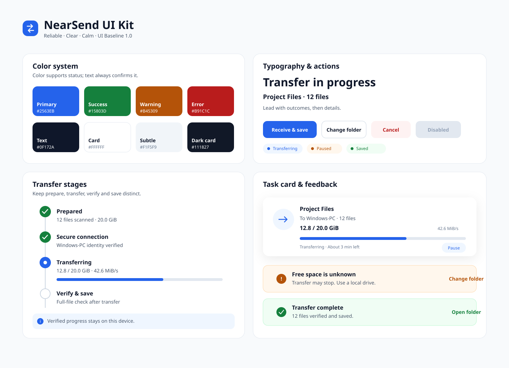
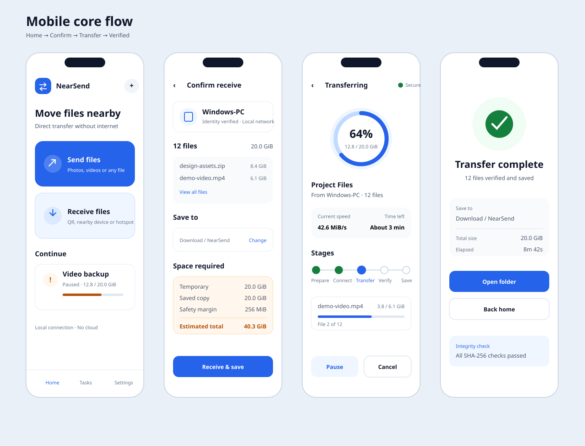
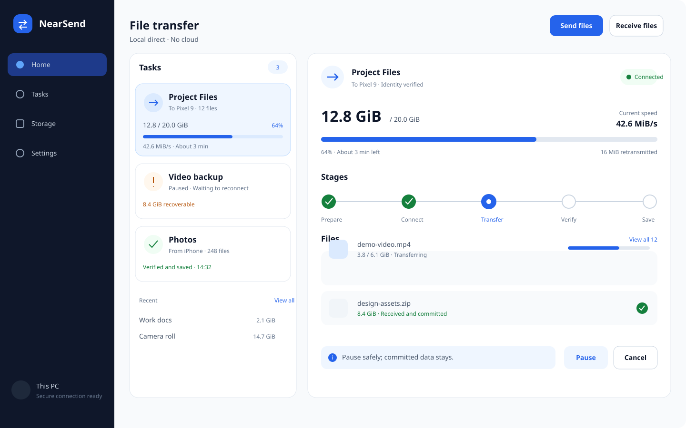

# NearSend UI 设计交付

本目录把 [UI/UX 规范](UI_UX_SPEC.md) 落为可直接指导 Flutter 实现的视觉基线。设计目标是“可靠、清晰、克制”：让用户看懂准备、连接、传输、校验和保存的区别，不用装饰掩盖真实状态。

## 设计稿

### 组件与视觉语言

### 移动端核心流程

### Windows 传输详情

## 实现入口

| 文件 | 用途 |
| --- | --- |
| [STYLE_GUIDE.md](STYLE_GUIDE.md) | 精确 Token、组件尺寸、状态和 Flutter 命名建议 |
| [UI_UX_SPEC.md](UI_UX_SPEC.md) | 页面、流程、文案、响应式和验收规则 |
| [ui-kit.svg](mockups/ui-kit.svg) | 色彩、排版、按钮、状态、进度与卡片视觉稿 |
| [mobile-core-flow.svg](mockups/mobile-core-flow.svg) | 手机首页、接收确认、传输与完成页面 |
| [windows-transfer.svg](mockups/windows-transfer.svg) | Windows 宽屏导航、任务列表和传输详情 |

## 状态说明

这些文件是 UI 视觉与交互设计基线，不代表 Flutter 页面已经实现。实现阶段必须使用真实 Design Token 和类型化任务状态，并通过 Widget、响应式和可访问性测试后，才能把对应 UI 任务标记为完成。

如果代码实现需要偏离视觉稿，优先保持状态语义、信息层级和可访问性；尺寸或颜色变化应同步修改本目录，避免代码和设计分叉。
